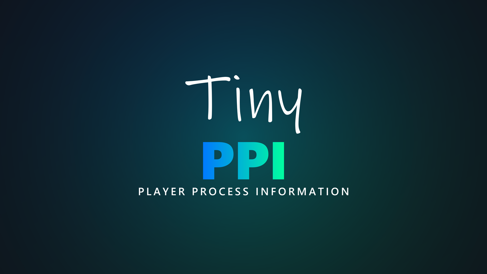

<p align="center">
  
</p>

A CoreELEC addon that displays detailed playback information in a custom overlay window during video playback. It provides real-time data on video, audio, HDR, system resources, and more — with special support for **Amlogic** hardware (e.g. CoreELEC devices).

---

## Screenshots
<p align="center">

</p>

<p align="center">

</p>

<p align="center">

</p>

---

## Installation

### Via Repository

1. Open **Settings → File Manager → Add Source**.
2. Enter the repository URL and confirm:
   ```
   https://ce-repo.github.io/repository.jamal2362/
   ```
3. Go to **Add-ons → Install from ZIP file** and select the source you just added.
4. Install the repository ZIP file.
5. Go to **Install from repository**, open the repository, select **TinyPPI** and install.

---

## Usage

### Assign a remote shortcut — Easy way (Keymap Editor)

1. Install the **Keymap Editor** addon.
2. Open it and select **Edit → Global → Add-ons**.
3. Select **Launch TinyPPI**.
4. Press the key or button you want to assign, then confirm.
5. Go back and select **Save**.

Pressing the assigned key/button will now launch or close TinyPPI in the Video OSD.

### Assign a remote shortcut — Manual (`gen.xml`)

Place the following in `Userdata/keymaps/gen.xml`, replacing `xxxxx` with your key name:

```xml
<keymap>
  <global>
    <keyboard>
      <xxxxx>RunAddon(script.tinyppi)</xxxxx>
    </keyboard>
  </global>
</keymap>
```

### Launch from another addon or autostart (Python)

```python
import xbmc
xbmc.executebuiltin('RunScript(script.tinyppi)')
```

### Launch via Kodi URL

```
plugin://script.tinyppi/
```

### The fastest shortcut there is

Every launch above starts a Python script, and Kodi builds a fresh interpreter
for one each time. TinyPPI's background service is already running with
everything loaded, so it opens the overlay itself and the launch is only there
to ask it to — which it does within a few milliseconds.

A keymap can ask it directly instead, skipping the script entirely:

```xml
<keymap>
  <global>
    <keyboard>
      <xxxxx>NotifyAll(script.tinyppi,open_overlay)</xxxxx>
    </keyboard>
  </global>
</keymap>
```

Use `open_dialog` in place of `open_overlay` for the VS10 mode dialog. The key
toggles the same way `RunAddon` does — pressed again while TinyPPI is up, it
closes it. This needs TinyPPI's service to be running, which it is unless the
addon has been disabled; `RunAddon(script.tinyppi)` keeps working either way and
falls back to opening the overlay in its own script if the service does not
answer.

---

## Codec Logos

TinyPPI can display the current **video (HDR) and audio format** as stacked logos
directly on the video window during playback. By default the video/HDR logo sits on
top and the audio logo below it, on a rounded panel whose colors and opacity are
fully themeable in the add-on settings. The logos are re-resolved live, so switching
the audio track updates the audio logo on the fly.

You can enable the logos in three independent situations (**Settings → Codec Logos**):

- **On playback start** — shown for the first few seconds after a video starts
  (duration configurable).
- **While the Video OSD is open** — shown whenever the player OSD is visible.
- **While the TinyPPI overlay is open** — shown alongside the info overlay.

For each situation the horizontal/vertical position and the size can be adjusted
separately, and so can the logo stack itself:

- **Logo order** — *Video on top, audio below* (default) or *Audio on top, video
  below*.
- **Show video codec logo** / **Show audio codec logo** — turn either one off to
  leave just the other logo on the panel. With both on, the panel keeps its
  all-or-nothing behavior and stays hidden for an audio codec that has no logo.
- **Dolby Vision pill position** — the layer pill (FEL / MEL / other DV profile)
  sits on the panel's *Bottom edge* (default) or its *Top edge*.

### Supported formats

**Video / HDR**

| Logo | Format |
|------|--------|
| SDR | Standard Dynamic Range |
| HDR10 | HDR10 |
| HDR10+ | HDR10+ |
| HLG | Hybrid Log-Gamma |
| Dolby Vision | Dolby Vision |

**Audio**

| Logo | Format |
|------|--------|
| AAC | AAC |
| AAC-LC | AAC Low Complexity |
| AAC LATM | AAC in LATM/LOAS |
| AAC-LTP | AAC Long Term Prediction |
| AAC-SSR | AAC Scalable Sample Rate |
| HE-AAC | High-Efficiency AAC |
| HE-AAC v2 | High-Efficiency AAC v2 |
| Dolby Digital | Dolby Digital (AC-3) |
| Dolby Digital Plus | Dolby Digital Plus (E-AC-3) |
| Dolby Digital Plus Atmos | Dolby Digital Plus with Dolby Atmos |
| Dolby TrueHD | Dolby TrueHD |
| Dolby TrueHD Atmos | Dolby TrueHD with Dolby Atmos |
| DTS | DTS |
| DTS 96/24 | DTS 96/24 |
| DTS-ES | DTS-ES |
| DTS-Express | DTS Express |
| DTS-HD HRA | DTS-HD High Resolution Audio |
| DTS-HD MA | DTS-HD Master Audio |
| DTS:X | DTS:X |
| IMAX | DTS:X IMAX Enhanced |
| FLAC | FLAC |
| PCM | PCM / LPCM |
| MP3 | MP3 |
| OGG | Ogg Vorbis |
| OPUS | Opus |
| VORBIS | Vorbis |

Formats without a matching logo simply omit the audio image.

---

## Channel Layout Graphic

TinyPPI can display a **speaker layout graphic** for the current audio track,
visualising how many channels the stream carries and where the active speakers
sit. The active speakers are highlighted against the full layout, so a 5.1 track
lights up its six positions while the remaining speaker slots stay dimmed.

The graphic can be enabled independently per output type
(**Settings → Channels**):

- **Channels in SDR** — show the layout while playing SDR content.
- **Channels in HDR10 / HLG / HDR10+** — show the layout while playing HDR content.
- **Channels in Dolby Vision** — show the layout while playing Dolby Vision content
  (drawn in its own panel above the main info box).

The colors of the background box, the speaker layout behind the active channels,
and the active channels themselves are all fully themeable in the add-on settings.

### Supported layouts

| Graphic | Layout |
|---------|--------|
| 1.0 | Mono |
| 2.0 | Stereo |
| 2.1 | Stereo + LFE |
| 3.1 | 3.1 surround |
| 4.1 | 4.1 surround |
| 5.1 | 5.1 surround |
| 5.1.2 | 5.1.2 with height channels (Atmos / DTS:X) |
| 6.1 | 6.1 surround |
| 7.1 | 7.1 surround |
| 7.1.2 | 7.1.2 with height channels (Atmos / DTS:X) |

The height variants (5.1.2 / 7.1.2) are selected automatically for Dolby Atmos
and DTS:X streams — Kodi reports only a channel count, so the extra height
channels are inferred from the codec. Channel counts without a matching graphic
simply omit the image.

---

## Dolby Vision Metadata View

Enable **Settings → Debug → Dolby Vision metadata view** first; it is off out of
the box, and while it is off **OK** on the overlay does nothing, exactly as
before.

With it on, pressing **OK** on the open TinyPPI overlay during a **Dolby
Vision** source switches to a debug view listing everything the stream's side
data carries — far more than the overlay itself has room for. Pressing **OK**
again switches back to the normal TinyPPI view; **Back** closes TinyPPI
altogether. Up/Down scroll through the list, which refreshes ten times a second,
so the per-frame blocks follow the picture. A reading that just moved is written
in the highlight colour and stays in it for **Settings → DV metadata → Changed
values → Highlight duration** (750 ms out of the box), so a change is readable
without slowing the refresh down; the overlay's own Dolby Vision readings have
the same pair of settings under **Settings → TinyPPI overlay → Changed values**.
On any other source **OK** keeps doing nothing: there is no Dolby Vision side
data to show.

The view is grouped by metadata block:

| Section | Contents |
|---------|----------|
| Stream | Kodi's own HDR type and detail, the side-data sections that arrived, the stream flags (`converted`, `rpu-removed`, …), the layer structure and the parser version |
| Configuration record | The dvcC / dvvC record: version, profile, compatibility ID, level, RPU / BL / EL presence, metadata compression |
| RPU | Guessed profile, CM version, DM compression, the DM metadata IDs, scene refresh flag and extension-block count, and the full RPU header (types, VDR profile / level / normalized IDC, the VDR sequence-info and DM-metadata presence flags, BL / EL / VDR bit depth, EL type, full range, resampling, residual and coefficient fields, previous-RPU reuse, the NAL prefix and the reserved field) |
| Composer | The reshaping metadata the decoder actually applies to the base layer: the mapping's colour space, chroma format and tile partitioning, then a section per component (Y, Cb, Cr) with its curve shape, its pivots and the coefficients of every segment — and, on the dual-layer profiles that carry one, the NLQ dequantization data |
| L1 | Frame luminance, min / max / average, as raw PQ codes and nits |
| Source master | The PQ range of the master the grade was made from, and its display diagonal |
| Colorimetry | The VDR DM signal description and the YCC → RGB / RGB → LMS matrices, in raw codes |
| L2 / L8 | Every trim pass, as raw 12-bit codes and on the Dolby UI scale, plus L8's secondary saturation / hue vectors on the streams that carry them and each pass's own block length |
| L3 | PQ offsets |
| L4 | Temporal stability: the anchor PQ and power |
| L5 | Active-area offsets (the black bars the RPU declares) |
| L6 | The RPU's own mastering display and MaxCLL / MaxFALL |
| L9 / L10 | Source primaries and the target displays the L8 trims are graded against, each with its block length |
| L11 | Content type, whitepoint, reference mode and the reserved bytes |
| L254 / L255 | The CM v4.0 marker block, and the debug run mode block on the rare stream that carries one |
| Static metadata | The MDCV / CLL SEIs — the stream's own HDR10 layer, shown apart from L6 |
| HDR10+ | The ST 2094-40 payload, when the stream carries one alongside Dolby Vision |

Blocks the stream does not carry are still listed, with their values shown as
`—`, so an absent block is visible rather than silently missing. Reading and
parsing is done by
[script.module.sidedata](https://github.com/matthane/script.module.sidedata);
the field names and units follow its own field reference.

Everything in the view is printed as the bitstream carries it, with one
exception: the composer's coefficients. The RPU splits each of them into an
integer and a fractional half that say nothing read apart, so they are shown
combined — `int + frac / 2 ** coefficient_log2_denom`, the arithmetic the RPU
syntax itself defines, with the denominator readable in the **RPU** section
above. The composer is also the one part of a parse TinyPPI asks for rather
than always builds: it runs to hundreds of coefficients, so it is read only
while this view is open and the overlay's own polling never pays for it.

---

## VS10 Dialog Layouts

The VS10 dialog — the menu that offers the player-process overlay and whatever
VS10 output modes the playing source has — is drawn in one of three designs.
Pick one under **Settings → VS10 dialog → Layout**:

| Layout | What it looks like |
| --- | --- |
| **Single button** | One button, and **left** or **right** steps it to the next choice. For a remote that has little more than a direction pad and OK. The default. |
| **Bar** | The choices side by side rather than stacked, in a panel low enough to leave most of the picture showing. |
| **Dialog** | The panel the add-on opened with before the layouts existed: the choices stacked. |

Every layout draws the same choices, and how many there are depends on the
source: four on SDR and HDR10, three on Dolby Vision, and the
player-process button on its own where there are no VS10 modes to offer —
HDR10+, HLG, and a Dolby Vision grade carrying HDR10+ alongside its RPU.
A layout keeps the same panel whichever of those is playing and spreads the
choices over it, so the dialog does not change size under you when the
detection finishes.

### Position

Under **Settings → VS10 dialog → Dialog position** the panel can be moved.
All three layouts are narrower than the screen, so both directions apply to
each of them:

- **Vertical position** — 0% is a margin below the top edge of the screen,
  100% rests the panel on the bottom one. Defaults to 100%.
- **Horizontal position** — 0% is the left margin and 100% the right one.
  Defaults to 50%.

The colours of every layout come from the **VS10 dialog** colour settings,
which now include **Button text** — the colour of the buttons the remote is
not sitting on, which the dialog used to take from the overlay's description
colour and so could not be set on its own.

## Web Dashboard

TinyPPI can serve everything the overlay shows to a browser on your phone or
laptop, so the readings can be followed **while the picture stays untouched**.
The dashboard is off out of the box; switch it on under **Settings →
Dashboard**, then open the address it names on any device on the same network:

```
http://<box-ip>:8099/
```

**Settings → Dashboard → Show address and token** prints that address together
with the access token, which is what you need standing in front of the TV with
a phone in your hand.

### What it shows

The page is split into six tabs, switched from a floating bar of icons at the
foot of the screen — the five of the TinyPPI app, in the same order, and the
settings:

| Tab | What is on it |
|---|---|
| **Live** | What is playing, the transport row, the VS10 output and every reading of the overlay |
| **Metadata** | The Dolby Vision metadata: the active picture area, the luminance chart and the full list (see below) |
| **Films** | Continue watching (films), the unwatched films and the whole film library |
| **Series** | Continue watching (episodes), the series with unwatched episodes and the whole series library |
| **History** | The metrics and the events of the title that is playing — or, for ten minutes after the credits, of the one that just ended |
| **Settings** | The theme, the access token and the two reports |

The address remembers the tab (`/#films`, `/#history`, …), so a bookmark or a
reload comes back to it, and each device reopens the tab it was left on. The
film and series tabs are only in the bar when the box offers those libraries,
and the metadata tab only while a Dolby Vision title is playing. Live,
metadata, history and settings stand centred between the two bars; the two
shelves start at the top.
The bar shows icons only; each key names its tab under a pointer and to a
screen reader. Like the app's, it steps away after three seconds with
nothing happening, handing its room at the foot of the page back to the last
card, and comes back with the next touch, scroll, key or pointer movement. The top bar carries just the name, the version and the
connection light.

- **Now playing** — the poster, title, year and genre, the file name (when
  *Show file name* is on), elapsed time and progress.
- **The format logos the overlay draws** — the very files from the add-on's own
  skin, so a Dolby Vision Atmos title wears the same two badges on the phone as
  it does on the TV.
- **Metrics** — the player cache, current frame rate, warning count and how
  often the output or a playback track was switched.
- **A live luminance chart** — the Dolby Vision L1 peak and frame average on a
  logarithmic scale, over the last minute, the last ten, or the whole title:
  the add-on has been sampling since playback started, so a page opened halfway
  through a film gets the part it missed instead of starting from empty.
- **Events** — a list with timestamps of the things worth knowing about: an
  output switched to or from Dolby Vision, a display mode change, the box
  running hot or its processor at full load, or the selected audio/subtitle
  track changing. A long list scrolls
  inside its own card rather than stretching the page under it.
- **What the last title came to** — for ten minutes after the credits the page
  keeps the film that just ended: a card of its own with its switch and warning
  totals, and the events of that film still under it. Those figures are
  worth most once a film is over, which used to be exactly when they were
  thrown away. Both are on the history tab.
- **Continue watching** — the films and episodes the box was stopped in the
  middle of, the last one seen first: the films at the top of the films tab,
  the episodes at the top of the series tab. Each poster carries how far it
  got, and a tap resumes it where it was (see below).
- **The film library** — the films in Kodi's video database as a wall of
  posters, and a tap starts one on the box (see below). Its tab is there
  whether or not anything is playing.
- **The series library** — the same wall again for what Kodi knows as TV
  shows, with how many episodes are still unwatched on each poster. A tap opens
  the show and a tap on one of its episodes starts it (see below).
- **The active picture area** the RPU declares (L5), drawn to scale inside the
  coded frame — the letterbox as the stream describes it, changing with the
  scene on an IMAX Enhanced title. It sits on the metadata tab, with the
  blocks it is read from.
- **Every row of the overlay**, grouped as it is on screen: Video, Processing,
  Audio, HDR static metadata, Dolby Vision metadata and System. A reading that
  just moved is highlighted the same way the overlay highlights it.
- **The Dolby Vision metadata view**, on a tab of its own (see below).
- **Copy report**, on the settings tab, hands the whole set over as plain
  text, ready to paste into a forum post — the rows, what the title added up
  to, and the events along the way. It works with nothing playing too, where it
  writes the report of the title that just finished. The second key beside it
  copies the metadata list. A key with nothing to copy is dimmed.
- **The access token** this device holds, all but its last two characters
  hidden, and a key to enter a new one — also on the settings tab.

What a source cannot carry is left out rather than shown empty: the peak and
average tiles, the luminance chart, the active-area box and both metadata
sections come from the Dolby Vision RPU, so they appear for a Dolby Vision
title and not for any other, and the HDR static-metadata group is left out on
an SDR one. That is the same rule the overlay follows when it decides which
panels to draw.

The row labels come from Kodi's own string table, so the dashboard is in the
same language the overlay is. Nothing is loaded from the internet: the page is
served entirely by the add-on and works on a box with no outside connection.
On a phone it can be added to the home screen.

### How it is laid out

The page takes the width it is given. On a phone it is one column, read top to
bottom: what is playing, every reading under it, then the figures, the charts
and the events. On a laptop or a tablet held sideways it becomes two — what is
playing down the left, what the playing of it has come to down the right — with
the readings running the full width beneath both, as many cards to a row as
fit. Nothing is hidden by the wider layout and nothing is added by the narrow
one; it is the same page, folded differently, so a phone and a desktop looking
at the same film show the same things in the same order.

Every panel below the film folds away, and each one remembers whether it was
open on that device — so a second screen left on a shelf can be trimmed to the
two or three readings that are being watched for.

### What it costs to leave open

A second screen is left running for the length of a film, so the page is built
not to be felt while it is:

- **It connects as it loads.** The stream is opened in the same breath as the
  page rather than after the translations have been fetched, so the dashboard
  is live about as fast as it can draw.
- **Only what moved is sent.** A browser is given one whole snapshot when it
  connects and, five times a second after that, only the readings that actually
  changed — which on a title standing still is a few dozen bytes where the
  snapshot it replaces is tens of kilobytes.
- **A page nobody is looking at is not connected.** Lock the phone or switch
  tabs and the stream is dropped; come back and it is up again immediately.
  That is the battery on the phone and one of the add-on's six stream slots,
  neither spent on a page in a pocket.
- **The page itself is cached.** Its files are sent with a validator and
  compressed, so opening the dashboard a second time fetches almost nothing,
  and the poster is fetched once per film however often the page is reopened.
- **A full server says so.** Open the dashboard on a seventh device and it
  reports that rather than sitting on "Disconnected"; it takes the first slot
  that frees.

### Themes

The settings tab switches the page between three themes, and every one of
them is dark — this is watched in the room the projector is in, so there is
nothing here for a lit one:

- **Dark** — the plain one, and what a first visit gets.
- **Dark (adaptive)** — the same page, with the **now-playing card** taking
  its colour from the poster of whatever is on screen. The artwork is read
  region by region and the one colour that stands for it best is drawn across
  the card as a broad glow — strongest beside the poster, spent well before the
  foot, so the bottom of the card is the same plain panel every other one is
  whether the controls are folded out or away.
  How much of the colour survives is worked out per film against the contrast
  the card's text needs: a dark poster keeps nearly all of it, a bright one is
  held down as far as it has to be, and both end up equally readable. No other
  card is painted: the surfaces around the film stay exactly what they are on
  the plain dark theme, so the page has one coloured thing on it and everything
  else is the page.
  What the other cards do take is the film's accent, for the things read past
  rather than read — the card headings, a badge, a button, the luminance
  chart's own traces — while the readings themselves keep the plain text
  colour. A title with no poster looks exactly as it does on the plain dark
  theme; there was nothing to take a colour from. While this theme is on, the
  settings tab also offers how strongly it tints: **subtle**, **standard** or
  **strong**.
- **Midnight** — deeper and bluer, for a room with nothing else lit in it.

The choice is remembered in the browser, per device, and is applied before the
page is first drawn, so reopening the dashboard never flashes the wrong theme.
The phone's own status bar follows it. Nothing is
sent to the add-on: the theme is the browser's business, not the box's.

### The Dolby Vision metadata tab

The **Metadata** tab — also reachable as `http://<box-ip>:8099/metadata`, the
address the view had when it was a window of its own, so an old bookmark still
lands on it — lists every block the stream's side data carries: the configuration record, the RPU from its header through L255, the
composer's reshaping curves, the trim passes and the static SEIs. It is the
same list the on-screen view shows,
built from the same rows, and it stays live: the per-frame blocks move with the
picture and a reading that just changed is highlighted, exactly as in the
overlay. On a wide screen it flows into two or three columns, never breaking a
section across them, and the metadata key under **Copy report** on the
settings tab hands the whole list over as plain text.

On any other source, and with nothing playing, the tab is not in the bar at
all; a page that is on it when the title ends goes back to the live tab.

It can be turned off entirely under **Settings → Dashboard** — it is the
largest thing the add-on sends, so on a slow network it is the first thing to
switch off.

### Starting a film from the browser

The **Films** tab is the **film library**: every film in Kodi's video
database, as posters, in the order Kodi files them. A tap starts one on the
television.

The tab is there whether or not anything is playing — lining up what comes
next is a fair thing to want from the phone halfway through a film — and a
search still being typed, or a show still open on the series tab, survives a
film starting under it.

It keeps itself up to date without being asked. Every snapshot carries the
version the box's library is on, and that number moves whenever what the
shelves would say moves — a film watched to the end, one switched off in the
middle, a scan that added a series — so a page left open on a shelf all evening
reads it again at the moment it goes out of date rather than showing this
afternoon's answer until somebody reloads it. A read that finds nothing has
actually changed costs a validator and leaves the wall, the search box and the
open show exactly as they were.

A film the box left half-watched carries a bar along the bottom of its poster
and is **resumed** where it was, the same as pressing it in Kodi's own window;
one already seen wears a tick in the corner of the picture. What **IMDb** made of it — or TMDb where IMDb has nothing to say — sits in the opposite corner of the poster, and is left off entirely where neither house has an opinion. Under the
title are the year and how long the film runs. The card carries a
search box, which narrows the wall as it is typed in; the cross inside it empties
it again and puts the whole shelf back.

The cards **arrive open** — the tab is there for the films — and each folds
away under its own heading with the number of titles beside it. How it was
left is remembered on each device.

The list is read from the video database once and held until Kodi says it
changed, so a film added mid-evening appears without anything being restarted,
and a phone that opens the page twice is answered the second time with a
validator rather than the whole library. A title ending is a moment or two
behind that: Kodi writes where it got to after it has said that playback
stopped — and says nothing at all when what it wrote was only a resume point —
so the held lists are dropped once the box has had its moment to write rather
than at the stop itself. The posters are fetched as they are
scrolled to, and each one crosses the network once: its address carries the
picture's own tag, so the browser keeps it.

They are also fetched small. A tile on a phone is a hundred and twenty pixels
wide and the poster behind it is what the scraper fetched — often two
thousand — which a browser has to carry over the network and then decode in
full before it can draw any of it. Kodi already keeps a smaller copy of
everything it has ever drawn, so a wall is served out of its texture cache
rather than out of the original, and falls back to the original only on a box
whose cache has just been cleared.

Out of the cache as Kodi already holds it, note, rather than asking it for a
smaller size still: the cache is keyed by the whole address, so a size nobody
has asked for before is an entry the box has to build — and for scraped
artwork, building one means fetching the original off the internet again. That
is a download per tile, which makes for a slower wall rather than a faster one.

Starting a film needs the access token and the same **Allow VS10 switching from
the dashboard** setting the rest of the controls need. The card itself can be
turned off under **Settings → Dashboard → Show the film library**, which stops
the list being read and served at all.

### Continue watching

At the top of the films tab and of the series tab is a row of the films —
respectively the episodes — left half-watched, the last one seen first: the
quickest way back into whatever was on. It scrolls sideways; an episode stands
on it as its show's poster, with which episode it is under the name. Every poster carries the same resume bar
the walls do and the same rating badge — a film its own, an episode its show's
— and a tap resumes it where it was.

It is read with Kodi's own "in progress" filter, holds the thirty most recent
titles, and is dropped and read again on the same occasions the shelves are, so
a film switched off in the middle is at the front of the row as soon as the box
has written where it got to. A row with nothing on it is no card at all. Films
are on it only where the film library is offered and episodes only where the
series library is.

### Watched and unwatched

A tap on a film, a series or an episode opens a dialog with three options:
**Play** (or **Resume**, where the box has a point to resume from),
**Mark as watched** and **Mark as unwatched**. For a series the first option is
**Open**, since a series cannot be played; its episodes can. Marking is written
into Kodi's own library, the way its context menu does it: a title marked
watched gets a play count and loses its resume point, one marked unwatched
loses its play count. A series marked either way is every episode of it.
Continue-watching tiles open the same dialog.

A film or an episode that was stopped part-way through gets two more options:
**Play from the beginning**, which starts it from the top without the resume
question on the television, and **Clear resume point**, which forgets where it
got to — taking it off the continue-watching row — while leaving it watched or
unwatched as it was.

Straight under **Continue watching** are two cards holding only what is still
**unwatched**: the films without a tick, and the series with an episode still
waiting; the walls of all films and all series follow them. The tiles ask the
same question as on the full walls, and opening an unwatched series opens it
in the series card further down. A card with nothing on it is not shown.

### Starting an episode from the browser

The **Series** tab is the same shelf again for the **series library**, with
one floor more. A series is not something that can be put on — an episode is — so a
tap on a poster does not start anything: the wall gives way to that show's
episodes, in the order they were made and each season folded away under its own
heading. A tap opens a season, a tap on one of its episodes starts it. The way
back out sits at the top of the card, where it is one tap away however far down
a show you have scrolled.

The seasons arrive folded, all of them: a series that has run for nine years is
several hundred rows, and a list that opened on all of them would open in the
middle of season one. Folded, a whole show is a dozen lines — which season, how
many episodes are in it and how long they run altogether — and it costs
nothing to draw, because a still inside a folded season is never fetched.

Each poster carries the number of episodes still unwatched in the corner a
watched film wears its tick in — the one number a shelf of series is scanned
for — and a show seen right through wears the tick instead. What **IMDb** made of it — or TMDb where IMDb has nothing to say — sits in the opposite corner of the poster, and is left off entirely where neither house has an opinion.

An episode half-watched carries the same bar along the bottom of its still and
is resumed where it was, and each row says how long that episode runs beside
the number it is.

The episodes of a show are read when that show is opened and not before: a
house with ninety series in it would otherwise be sent every episode of all of
them to draw a wall of ninety posters. What is read is then held beside the
shelf and dropped by the same notification, so a freshly scanned episode
appears without anything being restarted.

The series card arrives folded for the same reason the film card does, and
remembers per device how it was left. It has a setting of its own —
**Settings → Dashboard → Show the series library** — so a box can offer the
films and not the series, or the other way round.

### Switching VS10 from the browser

With **Allow VS10 switching from the dashboard** on (the default), the page
shows the output modes that apply to the playing source — the same set the
on-screen VS10 dialog offers, SDR sources included — and a tap applies one.
The switch is handed to the add-on's own `run_mode` entry point, so it takes
exactly the path a keymap shortcut takes, native VS10 actions included.

**HDR10+** and **HLG** are the two sources with no modes: neither is a VS10
input, so the driver has no group for either and the on-screen dialog draws
none — both are left with the player-process button alone. The dashboard
follows, and hides the whole VS10 card — output line included — for the length
of an HDR10+ or HLG stream. HDR10 keeps its three.

A **Dolby Vision title with an HDR10+ track** is the third: it reads as Dolby
Vision, because the RPU is what it is, but the driver does not take the Dolby
Vision group's modes while the ST 2094-40 payload rides along with it. Both the
dialog and the dashboard leave that hybrid grade with no modes rather than
offer a switch that does nothing. A stream whose HDR10+ Kodi has stripped for a
display that cannot show it keeps its modes: what was removed is no longer in
what the decoder is fed.

Switching **always** requires the access token, whatever reading is set to.

### The remote

The same setting turns on the transport row under the progress bar, in two
rows of its own: ten seconds, a minute and ten minutes either way on the first,
and on the second a chapter back, play and pause, quieter, mute, louder, stop
and a chapter on. Under them sits a picker each for the audio track and the
subtitles. Tapping the progress bar itself seeks there, and the arrow keys
nudge it ten seconds when it has the focus.

The volume steps rather than slides, and that is what lets it reach an
amplifier. Kodi's own volume is a number inside the Kodi process, and a box
whose CEC adapter is set to pass volume on leaves that number alone and sends
the amplifier a CEC command instead — from the input path, which an action
reaches and an absolute level never does. So the two steps go in as the actions
a remote sends: a soundbar answers them wherever the remote's own volume keys
reach it, and Kodi's own mixer answers them everywhere else, with nothing to
configure here either way.

What that costs is the level itself. CEC carries "up", "down" and "mute" and
has no command for "set it to forty" — and the level Kodi does report is its
own mixer's, which on such a box sits still while the room gets louder. So no
figure is shown at all, and the three keys say what they do rather than where
they have got to.

Every one of them goes through Kodi's own JSON-RPC into the running player, and
the page only offers what the player actually reports — a file with one audio
track shows no audio picker, and on one with no chapters the two chapter keys
are dimmed rather than left to seek a minute instead. Like the VS10 buttons,
they need the access token, and with **Allow VS10 switching from the
dashboard** off the row is not drawn at all.

The remote sits on the live tab, one press away from every other tab in the
bar.

### Security

The dashboard is reachable by anything on the same network while it is on, so:

- It is **off by default** and has to be switched on deliberately.
- **Do not forward its port to the internet.** It is meant for a home network.
- The **access token** is required for every VS10 switch. Turn on **Require the
  token for reading too** if the network the box is on is shared — the page
  then asks for the token before it shows anything at all.
- **Generate a new token** replaces it and logs out every browser still holding
  the old one.
- The file name obeys the overlay's own *Show file name* setting: with it off,
  the path is not sent to the browser either.
- Only a fixed set of routes is served — no path is ever resolved against the
  filesystem.

Leave port 8080 alone; Kodi's own web server usually has it. 8099 is the
default here.

---

## Advanced Launch Arguments

TinyPPI supports additional arguments to open specific modes or apply VS10 output modes directly — without opening the overlay or the dialog first.

### Open the VS10 mode selection dialog

```
RunScript(script.tinyppi,dialog)
```

Opens the VS10 mode selection dialog instead of the main TinyPPI overlay.
It shows the modes that apply to the playing source; on an **HDR10+** or
an **HLG** stream — neither of which is a VS10 input — it draws no modes at
all and leaves the player-process button on its own. A **Dolby Vision title
that carries HDR10+ alongside its RPU** is drawn the same way: the driver does
not take a VS10 mode for that hybrid grade, so none is offered. `run_mode`
still applies one there, and says so in the log.

### Apply a VS10 output mode directly

Use `run_mode` followed by the mode name to switch the VS10 output mode immediately. This is useful for keymap shortcuts or automation from other addons.

```
RunScript(script.tinyppi,run_mode,sdr8)
RunScript(script.tinyppi,run_mode,sdr10)
RunScript(script.tinyppi,run_mode,hdr10)
RunScript(script.tinyppi,run_mode,dv)
RunScript(script.tinyppi,run_mode,original_sdr)
RunScript(script.tinyppi,run_mode,original_hdr)
RunScript(script.tinyppi,run_mode,original_dv)
```

| Mode | Description |
|------|-------------|
| `original_sdr` | Pass through SDR content unchanged |
| `original_hdr` | Pass through HDR10 content unchanged |
| `original_dv` | Pass through Dolby Vision content unchanged |
| `hdr10` | Convert to HDR10 output |
| `dv` | Convert to Dolby Vision output |
| `sdr8` | Convert to SDR 8-bit output |
| `sdr10` | Convert to SDR 10-bit output |

#### Example: keymap shortcut for a direct mode switch

```xml
<keymap>
  <global>
    <keyboard>
      <xxxxx>RunScript(script.tinyppi,run_mode,hdr10)</xxxxx>
    </keyboard>
  </global>
</keymap>
```

#### Example: trigger from another addon (Python)

```python
import xbmc
xbmc.executebuiltin('RunScript(script.tinyppi,run_mode,dv)')
```

---

## Credits

TinyPPI builds on the work of the following projects — many thanks to their authors and contributors.

### script.module.sidedata

[**script.module.sidedata**](https://github.com/matthane/script.module.sidedata) by [matthane](https://github.com/matthane)

Parsers for the raw Dolby Vision and HDR payloads CoreELEC 22 publishes through
`Player.Process(video.sidedata)` — the Dolby Vision RPU and dvcC/dvvC
configuration record, the HDR10+ ST 2094-40 metadata and the static MDCV / CLL
SEIs. TinyPPI reads every DV/HDR value it shows through this module, so the
overlay follows the stream frame by frame instead of probing the file. RPU
parsing is done by quietvoid's [dovi_tool](https://github.com/quietvoid/dovi_tool)
(libdovi), HDR10+ parsing by FFmpeg's libavutil.


---

## License

TinyPPI's **source code** is licensed under the
[**GNU Affero General Public License v3.0 or later**](LICENSE).

The AGPL was chosen over the plain GPL because TinyPPI serves a web dashboard
over the network. Section 13 means that anyone who modifies TinyPPI and lets
others reach it over a network has to offer those users the source of the
modified version — the same obligation a modified copy handed out as a file
already carries.

The **name, the logo and the artwork** are not covered by that license; they
are [all rights reserved, with a limited redistribution license](LICENSE-ASSETS)
for unmodified releases. Forking the code is expressly welcome — a fork just
needs its own name and its own artwork, the way a Firefox rebuild needs to be
called something else. The format logos (Dolby, DTS, IMAX) belong to their
respective owners and are used only to identify the format a stream carries.

Third-party attributions are collected in [NOTICE](NOTICE).

Versions up to and including **2.7.6** were released under the MIT license and
remain available under it.
